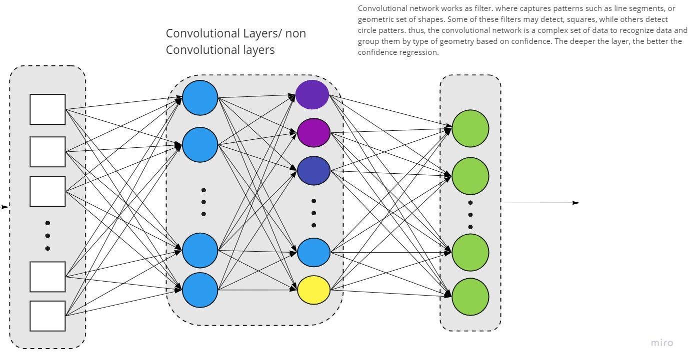

# deep-ai-phoneapps-webapps
- After understanding the methodology in full stack develpment and web applications, 
I decided to take my experience with Artificial intelligence one step further. Using the power of mathematics, neural networks, I will be able to build secure/fast Deep learning AI projects.

## Feature Object/image recognition/text recognition locations:
In this folder, there will be projects focused on Web Applications using Html, Css, Javascript
[Web App](gwitr/Readme.md)

In this folder, there will be projects focused on using Android environment.
[Android Apps](app/java/Readme.md)

## Feature Pose Recognizer :
In this we find out correct form as it is one of the major issues in fitness. To prevent injuries
and build on knowledge, the app will count the reps and guide form.

[Fitness App](fitnessapp/Readme.md)

## Project wireframing

